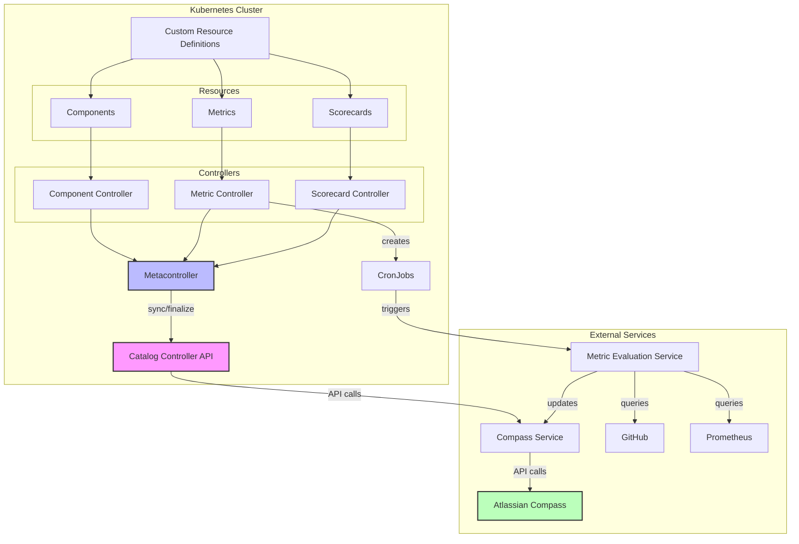

# Architecture Overview

## Table of Contents
- [System Components](#system-components)
- [Integration Flow](#integration-flow)
- [Data Model](#data-model)
  - [Component](#component)
  - [Metric](#metric)
  - [Scorecard](#scorecard)
- [Architecture Diagram](#architecture-diagram)
- [API Specification](#api-specification)

## System Components

The Catalog Controller system consists of the following key components:

1. **Kubernetes Custom Resource Definitions (CRDs):**
   - **Component:** Represents a service, library, or other technical component
   - **Metric:** Defines a specific quality metric to evaluate against components
   - **Scorecard:** Combines multiple metrics to grade components on specific areas

2. **Metacontroller Controllers:**
   - **Component Controller:** Manages Component resources
   - **Metric Controller:** Manages Metric resources and creates CronJobs for evaluation
   - **Scorecard Controller:** Manages Scorecard resources

3. **Catalog Controller API Service:**
   - FastAPI-based service that handles synchronization and finalization requests
   - Implements reconciliation logic for all custom resources
   - Interfaces with Compass Service to sync data to Atlassian Compass

4. **Downstream Services:**
   - **Compass Service:** REST API wrapper for Atlassian Compass
   - **Metric Evaluation Service:** Evaluates metrics based on defined facts and criteria

5. **Kubernetes CronJobs:**
   - Automatically generated for scheduled metric evaluation
   - Invokes the Metric Evaluation Service with metric specifications

## Integration Flow

1. **Resource Creation and Updates:**
   - Custom resources (Component, Metric, Scorecard) are created or updated in Kubernetes
   - Metacontroller detects changes and calls the Catalog Controller API Service

2. **Resource Reconciliation:**
   - Catalog Controller synchronizes resource state with Atlassian Compass
   - Creates/updates corresponding entities in Compass
   - Updates status in the Kubernetes resources

3. **Metric Evaluation:**
   - CronJobs automatically trigger metric evaluations on schedule
   - Metric Evaluation Service performs checks against various sources (GitHub, Prometheus, etc.)
   - Results are pushed back to Compass and reflected in component scorecards

4. **Resource Finalization:**
   - When resources are deleted, Metacontroller triggers finalization
   - Catalog Controller handles cleanup in Compass and related resources

## Data Model

### Component
Components represent services, libraries, or other technical assets. They include:
- Metadata (name, description, slug)
- Type information (componentType, typeId)
- Dependencies and relationships
- Links to documentation, repositories, and dashboards
- Team ownership information (tribe, squad)

### Metric
Metrics define specific measurements for component quality. They include:
- Description and format
- Grading system category (observability, security, etc.)
- Facts and rules for evaluation
- Component type applicability
- Evaluation schedule

### Scorecard
Scorecards combine metrics to grade components in specific areas. They include:
- Component type applicability
- Evaluation criteria based on metric values
- Scoring strategy and importance level
- Ownership information

## Architecture Diagram

The architecture leverages Kubernetes' Metacontroller pattern to effectively manage custom resources while maintaining a clean separation of concerns between resource management and business logic. The Catalog Controller API service acts as the central reconciliation point, ensuring that resources defined in Kubernetes are properly synchronized with Atlassian Compass.

## API Specification

The Catalog Controller API provides endpoints for managing Components, Metrics, and Scorecards in Kubernetes using the Metacontroller pattern. This API synchronizes custom resources with Atlassian Compass and manages their lifecycle.
For detailed API specifications, refer to the [API Specification](api-spec.md) document. 