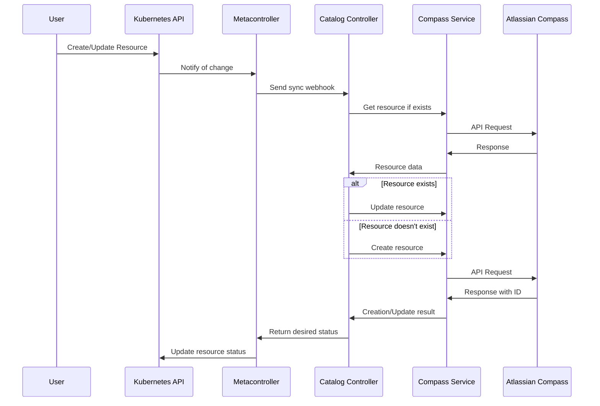
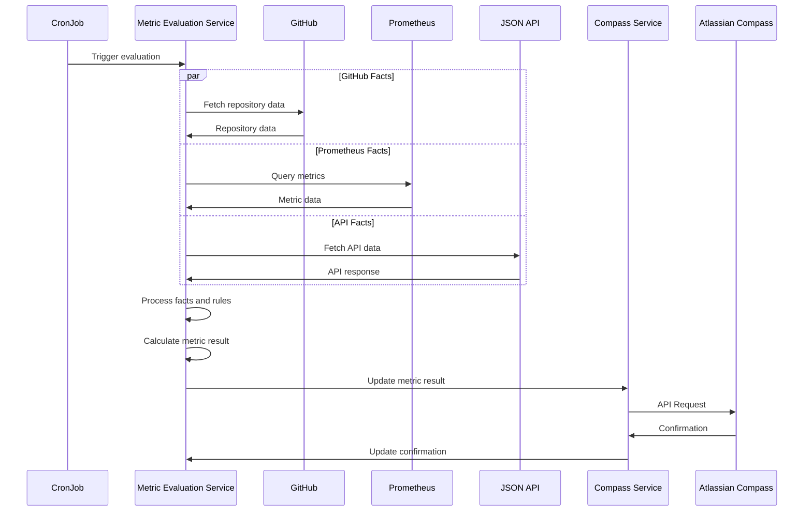

# Design Documentation

## Custom Resource Definitions (CRDs)

The Catalog Controller is built around three primary Custom Resource Definitions:

### Component CRD

The Component CRD represents a service, library, or other technical component in your organization. Key design aspects include:

- **Spec Fields:**
  - `componentType`: High-level type classification (service, library, etc.)
  - `name`: Human-readable name
  - `slug`: URL-friendly identifier
  - `description`: Detailed description
  - `typeId`: Specific type identifier (SERVICE, LIBRARY, etc.)
  - `dependsOn`: Dependencies on other components
  - `links`: URLs to repositories, dashboards, documentation, etc.
  - `tribe` and `squad`: Team ownership information

- **Status Fields:**
  - `id`: Unique identifier in Compass
  - `ownerId`: Team owner identifier in Compass
  - `metricAssociation`: Links between metrics and their Compass identifiers

### Metric CRD

The Metric CRD defines specific measurements for evaluating component quality:

- **Spec Fields:**
  - `name`: Metric identifier
  - `description`: Purpose and documentation link
  - `format`: Unit of measurement
  - `componentType`: Types of components this applies to
  - `grading-system`: Category (observability, security, etc.)
  - `facts`: Evaluation criteria and data extraction rules
  - `cronSchedule`: When to evaluate the metric

- **Status Fields:**
  - `id`: Unique identifier in Compass
  - `cronJob`: Status of the associated CronJob

### Scorecard CRD

The Scorecard CRD combines metrics to evaluate components in specific areas:

- **Spec Fields:**
  - `name`: Scorecard identifier
  - `componentTypeIds`: Types of components this applies to
  - `criteria`: Metric-based evaluation criteria
  - `importance`: Required, recommended, or optional
  - `scoringStrategyType`: Weight-based or point-based

- **Status Fields:**
  - `id`: Unique identifier in Compass
  - `metricsSummary`: List of metrics with validation status
  - `metricAssociation`: Links between metrics and their Compass identifiers

## Controller Design

The system uses Metacontroller to implement a composite controller pattern:

1. **CompositeController Resources:**
   - One controller per CRD type (Component, Metric, Scorecard)
   - Each controller defines sync and finalize webhooks
   - Controllers specify their parent resource and any child resources

2. **Webhook Implementation:**
   - FastAPI endpoints implement the controller logic
   - Separate handler modules for each resource type
   - Common utility code for Compass API interaction

3. **Metric Evaluation:**
   - Metrics controller manages CronJob child resources
   - CronJobs trigger evaluation through the Metric Evaluation Service
   - Results are pushed to Compass via the Compass Service

## Reconciliation Process

The reconciliation process follows these key steps for each resource:

### Component Reconciliation

1. Check if the component exists in Compass (via status.id)
2. If it exists, retrieve and update it; otherwise, create it
3. Identify applicable metrics based on component type
4. Associate the component with metrics in Compass
5. Update the component status with Compass IDs and metric associations

### Metric Reconciliation

1. Check if the metric exists in Compass (via status.id)
2. If it exists, retrieve and update it; otherwise, create it
3. Generate a CronJob for scheduled evaluation if cronSchedule is specified
4. Update the metric status with Compass ID and CronJob status

### Scorecard Reconciliation

1. Check if the scorecard exists in Compass (via status.id)
2. If it exists, retrieve and update it; otherwise, create it
3. Validate that all referenced metrics exist
4. Update the scorecard status with Compass ID and metric validation information

## Design Decision Records

### 1. Use of Metacontroller

**Decision:** Use Metacontroller to implement controllers rather than writing custom controllers.

**Rationale:**
- Reduces boilerplate code for watching and responding to resource events
- Separates controller logic (webhook handlers) from Kubernetes integration
- Allows controllers to be defined declaratively in Helm charts
- Simplifies management of parent-child resource relationships

### 2. Separation of Compass Integration

**Decision:** Create a separate Compass Service for Compass API integration.

**Rationale:**
- Decouples Compass API details from controller logic
- Allows for easier testing and mocking of Compass interactions
- Centralizes authentication and error handling for Compass API
- Enables future expansion to other external systems

### 3. Facts-based Metric Evaluation

**Decision:** Define metrics using a facts-based system with specific rules and sources.

**Rationale:**
- Provides a flexible framework for different types of evaluations
- Supports multiple data sources (GitHub, Prometheus, JSON APIs)
- Enables complex dependencies between evaluation steps
- Allows for both extraction and validation of data

### 4. CronJob-based Scheduling

**Decision:** Use Kubernetes CronJobs for scheduled metric evaluation.

**Rationale:**
- Leverages Kubernetes' built-in scheduling capabilities
- Provides automatic retry and history for failed evaluations
- Decouples evaluation scheduling from the controller service
- Makes evaluation timing and status visible through Kubernetes resources

## Design Diagrams

### Controller Interaction Flow



### Metric Evaluation Flow



### Resource Relationship Model

```mermaid
erDiagram
    Component ||--o{ Scorecard : "evaluated by"
    Metric ||--o{ Scorecard : "included in"
    Component ||--o{ Metric : "measured by"
    Metric ||--o{ CronJob : "evaluated by"
    
    Component {
        string name
        string componentType
        string typeId
        string[] dependsOn
        string tribe
        string squad
    }
    
    Metric {
        string name
        string grading-system
        string[] componentType
        object[] facts
        string cronSchedule
    }
    
    Scorecard {
        string name
        string[] componentTypeIds
        object[] criteria
        string importance
        string scoringStrategyType
    }
    
    CronJob {
        string schedule
        string command
    }